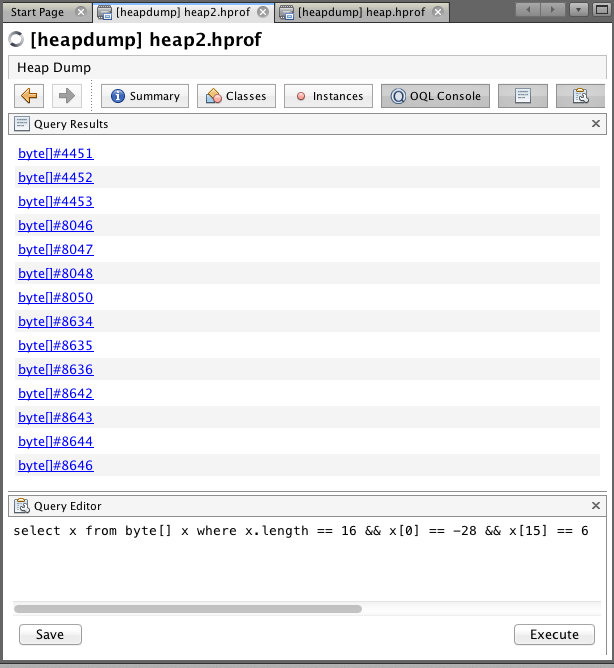
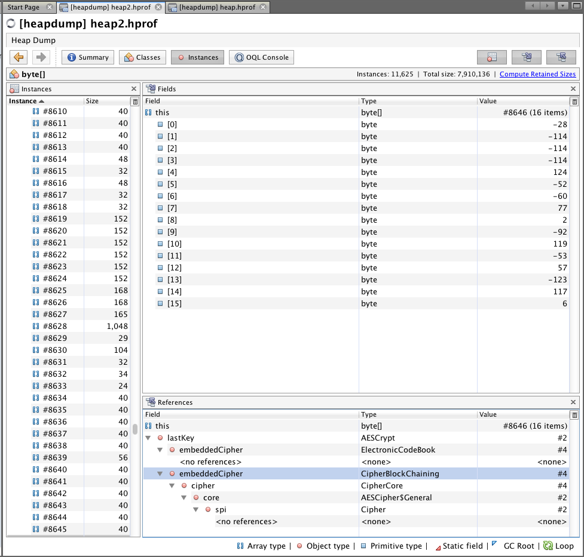

# Analyzing the Heap

After the request is finalized we can take a look at the heap of the running instance to see what
is left. The first thing we need to do is dump the current heap to a file for analysis.

```sh
jmap -dump:file=heap.hprof <process_id>
```

We will use this file in our analysis. Keeping in the spirit of using tools provided by the
language, we will use `jvisualvm` to analyze our file. We will launch the tool and load our heap
dump. Before we go searching we are going to get a better idea of what to search for. This should
be considered cheating, as an attacker wouldn't have the key before looking for it. For the
purpose of demonstration we can isolate our search given the information and get to the issue
faster.

The following code will load our keystore and print the encryption key:

## Grabbing the encryption key

```java
import java.io.FileInputStream;
import java.io.IOException;
import java.io.InputStream;
import java.security.*;
import java.security.cert.CertificateException;
import java.util.Arrays;
import java.util.Properties;

public class DumpKey {
    public static void main(String[] args) {
        Key key = loadKey();
        System.out.println(Arrays.toString(key.getEncoded()));
    }

    private static Key loadKey() {
        try {
            Properties properties = new Properties();
            InputStream in = Crypto.class.getResourceAsStream("server.properties");
            properties.load(in);
            in.close();
            String location = properties.getProperty("keystore.location");
            String alias = properties.getProperty("keystore.alias");
            String password = properties.getProperty("keystore.password");
            InputStream inputStream = new FileInputStream(location);
            KeyStore keyStore = KeyStore.getInstance("JCEKS");
            keyStore.load(inputStream, password.toCharArray());
            inputStream.close();

            return keyStore.getKey(alias, password.toCharArray());
        } catch (KeyStoreException | CertificateException |
                NoSuchAlgorithmException | IOException |
                UnrecoverableKeyException e) {
            e.printStackTrace();
            throw new RuntimeException("Could not load key");
        }
    }
}
```

We can invoke our code using the following:

```sh
$ mvn exec:java -Dexec.mainClass=DumpKey

[-28, -114, -114, -114, 124, -52, -60, 77, 2, -92, 119, -53, 57, -123, 117, 6]
```

Now that we have our key we can narrow our search using the OQL console. The following query:

```
select x from byte[] x where x.length == 16 && x[0] == -28 && x[15] == 6
```

Produces these results. The query is quite simple and just asks the heap for all instances of
byte[] that are sixteen elements long (the length of and AES-128 key) where the first element
equals -28 and the last element equals 6. It is entirely possible that we get a match that isn't
our key, but we could easily extend the query to be exact if we needed to. We see the following
results.



If we click on any of the results we see the key we are looking for.



What is interesting here is that we see many copies of our key (14 to be exact) on the heap.
This is after starting the server and performing one encrypt and one decrypt request. We can now
see the profliferation of key material and the need to better understand what is happening as the
request is processed.
